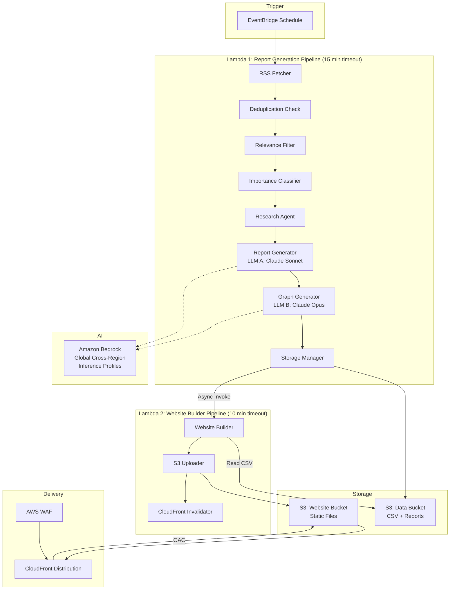
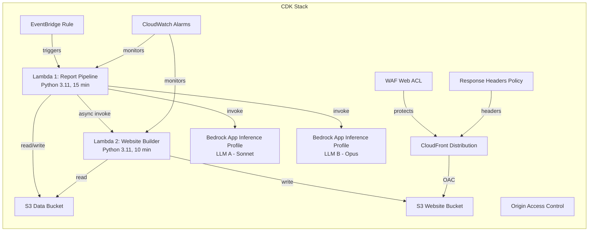

# Design Document: AWS AI News Hub

## Overview

AWS AI News Hub ("AI Radar AWS") transforms the existing aws-news-extractor pipeline into a full content platform. The current system fetches the AWS "What's New" RSS feed, filters for AI relevance, and sends email notifications. The new system extends this with:

1. **Point-based importance classification** — A configurable scoring system that combines service type, blogpost link presence, and word count into a star rating (1–3 stars)
2. **Research phase** — Follows links in announcements to gather context from blogposts and documentation
3. **LLM-powered report generation** — Uses Amazon Bedrock (Claude Sonnet for reports, Claude Opus for Mermaid diagrams) to produce structured, insightful content
4. **Static website** — A public S3/CloudFront site with composable filtering, timeline visualization, and PDF export

The system uses a **two-Lambda architecture** for resilience and separation of concerns:
- **Lambda 1 (Report Generation Pipeline)** — Handles the heavy lifting: RSS fetching, deduplication, filtering, classification, research, report generation, graph generation, and CSV storage in S3. Triggered daily by EventBridge with a 15-minute timeout.
- **Lambda 2 (Website Builder Pipeline)** — Reads the CSV from S3, generates static HTML/CSS/JS, uploads to the website S3 bucket, and invalidates CloudFront. Triggered asynchronously after Lambda 1 completes with a 10-minute timeout.

The two pipelines are **isolated** — if the website build fails, the report data is still safely stored. If report generation fails partway through, whatever was saved is still available for the website builder to use on its next invocation.

## Architecture

### High-Level Architecture



### Data Flow

**Lambda 1: Report Generation Pipeline**

1. **EventBridge** fires daily at the configured UTC time
2. **RSS Fetcher** retrieves the AWS "What's New" feed (retries 3× with exponential backoff)
3. **Deduplication** loads existing announcement links from CSV in S3, skips known items
4. **Relevance Filter** applies regex patterns against title + first 200 chars of description
5. **Importance Classifier** computes a point score and maps to 1/2/3 stars
6. **Research Agent** follows blogpost/doc links, extracts text content (up to 5 min per announcement, tracks remaining Lambda time)
7. **Report Generator** calls Bedrock (Claude Sonnet via global cross-region inference profile) to produce structured report sections
8. **Graph Generator** calls Bedrock (Claude Opus via global cross-region inference profile) to produce Mermaid diagrams for 2-star and 3-star announcements
9. **Storage Manager** appends results to CSV in S3
10. **Pipeline Summary** logs structured run summary, records any failed announcements to error file
11. **Async Invoke** triggers Lambda 2 asynchronously via `lambda:InvokeAsync`

**Lambda 2: Website Builder Pipeline**

1. **Triggered** asynchronously by Lambda 1 after CSV is updated
2. **Read CSV** loads all announcement data from S3 data bucket
3. **Website Builder** generates static HTML/CSS/JS files using Python string templates
4. **S3 Uploader** uploads generated files to the website S3 bucket
5. **CloudFront Invalidator** creates a CloudFront invalidation for `/*`
6. On failure, preserves existing site files (no partial uploads)

### Deployment Architecture



## Components and Interfaces

### 1. Configuration Module (`config.py`)

Central configuration file containing all tunable parameters. Changes take effect on next Lambda execution without redeployment.

```python
class Config:
    # AWS Region
    aws_region: str = "us-east-1"
    
    # Schedule
    schedule_hour: int = 22
    schedule_minute: int = 0
    
    # LLM A - Report Generator (Claude Sonnet)
    llm_a_model_id: str = "us.anthropic.claude-sonnet-4-20250514-v1:0"
    llm_a_temperature: float = 0.3
    llm_a_max_tokens: int = 4096
    llm_a_inference_profile_name: str = "ai-radar-report-generator"
    
    # LLM B - Graph Generator (Claude Opus)
    llm_b_model_id: str = "us.anthropic.claude-opus-4-20250514-v1:0"
    llm_b_temperature: float = 0.2
    llm_b_max_tokens: int = 2048
    llm_b_inference_profile_name: str = "ai-radar-graph-generator"
    
    # Importance Scoring
    service_points_high: int = 3      # Bedrock, AgentCore, SageMaker AI, QuickSight
    service_points_medium: int = 2    # SageMaker, Unified Studio, Kiro
    service_points_base: int = 1      # All other relevant services
    blogpost_points: int = 2          # Points for having blogpost links
    word_count_scale: float = 0.005   # Points per word (e.g., 400 words = 2 points)
    threshold_2_star: float = 3.0     # Score >= this → 2-star
    threshold_3_star: float = 5.0     # Score >= this → 3-star
    
    # Prompt Templates
    report_prompt_template: str = "..."
    graph_prompt_template: str = "..."
    
    # Research
    research_timeout_per_announcement: int = 300  # 5 minutes
    
    # RSS
    rss_url: str = "https://aws.amazon.com/about-aws/whats-new/recent/feed/"
    rss_fetch_timeout: int = 30
    rss_max_retries: int = 3
    
    # Lambda 2
    website_builder_function_name: str = "ai-radar-website-builder"
    website_builder_timeout: int = 600  # 10 minutes
```

### 2. RSS Fetcher

**Interface:**
```python
class RSSFetcher:
    def __init__(self, config: Config, logger: StructuredLogger): ...
    def fetch(self) -> list[RSSItem]: ...
```

**Behavior:**
- Fetches from `config.rss_url` with 30s timeout
- Retries up to 3× with exponential backoff (1s, 2s, 4s)
- Extracts title, description, publication date, link from each `<item>`
- Returns list of `RSSItem` dataclass instances

### 3. Relevance Filter

**Interface:**
```python
class RelevanceFilter:
    def __init__(self, config: Config, logger: StructuredLogger): ...
    def filter(self, items: list[RSSItem]) -> list[RSSItem]: ...
    def is_relevant(self, item: RSSItem) -> bool: ...
```

**Behavior:**
- Matches regex patterns against `title + description[:200]`
- Uses word-boundary matching (`\b`) to avoid false positives
- Applies exclusion patterns first (e.g., "Amazon Connect" agent references)
- Item is relevant if it matches ≥1 inclusion pattern and 0 exclusion patterns

### 4. Importance Classifier

**Interface:**
```python
class ImportanceClassifier:
    def __init__(self, config: Config, logger: StructuredLogger): ...
    def classify(self, item: RSSItem) -> tuple[int, float]: ...
    def compute_score(self, item: RSSItem) -> float: ...
```

**Behavior:**
- Computes score = service_points + blogpost_points + (word_count × scale)
- Service tier lookup: maps service name → point value from config
- Blogpost detection: checks for external links in description
- Star mapping: score < threshold_2_star → 1★, score < threshold_3_star → 2★, else → 3★
- Returns (star_level, raw_score)

### 5. Research Agent

**Interface:**
```python
class ResearchAgent:
    def __init__(self, config: Config, context, logger: StructuredLogger): ...
    def research(self, item: RSSItem) -> ResearchContext: ...
```

**Behavior:**
- Extracts URLs from announcement description and link field
- Fetches each URL with timeout, extracts main text content (strips nav/headers/footers/ads)
- Tracks remaining Lambda execution time via `context.get_remaining_time_in_millis()`
- If remaining time < research_timeout_per_announcement, skips remaining announcements
- Returns `ResearchContext` with gathered text content

### 6. Report Generator

**Interface:**
```python
class ReportGenerator:
    def __init__(self, config: Config, logger: StructuredLogger): ...
    def generate(self, item: RSSItem, research: ResearchContext) -> Report: ...
```

**Behavior:**
- Constructs prompt from template + announcement data + research context
- Calls Bedrock `invoke_model` using the application inference profile ARN for LLM A
- Uses global cross-region inference profile as the model source
- Retries up to 2× on failure
- Parses response into structured Report sections

### 7. Graph Generator

**Interface:**
```python
class GraphGenerator:
    def __init__(self, config: Config, logger: StructuredLogger): ...
    def generate(self, item: RSSItem, report: Report) -> str | None: ...
```

**Behavior:**
- Skips if importance_level == 1 (returns None)
- Constructs prompt from template + announcement + report context
- Calls Bedrock `invoke_model` using the application inference profile ARN for LLM B
- Uses global cross-region inference profile as the model source
- Retries up to 2× on failure; returns None on persistent failure
- Returns Mermaid diagram string

### 8. Storage Manager

**Interface:**
```python
class StorageManager:
    def __init__(self, config: Config, s3_client, logger: StructuredLogger): ...
    def load_existing_links(self) -> set[str]: ...
    def save_announcement(self, announcement: ProcessedAnnouncement) -> bool: ...
    def save_error_record(self, error: AnnouncementError) -> bool: ...
```

**Behavior:**
- CSV stored at `s3://{data_bucket}/database/announcements.csv`
- Error records stored at `s3://{data_bucket}/errors/failed_announcements.csv`
- Uses announcement link as unique key for deduplication
- Appends new rows (never overwrites existing)
- S3 uploads use `ServerSideEncryption='AES256'`
- Retries S3 writes up to 3×

### 9. Website Builder (Lambda 2)

**Interface:**
```python
class WebsiteBuilder:
    def __init__(self, config: Config, s3_client, cloudfront_client, logger: StructuredLogger): ...
    def build_and_deploy(self) -> bool: ...
```

**Behavior:**
- Reads all announcements from CSV in S3 data bucket
- Generates static HTML/CSS/JS files using Python string templates
- Produces: index.html (listing + filters + timeline), individual report pages, shared CSS/JS assets
- Uploads to S3 website bucket
- Creates CloudFront invalidation for `/*`
- On failure, preserves existing site files (no partial uploads)
- Operates independently of Lambda 1 — uses only the CSV as its input contract

### 10. Pipeline Orchestrator (Lambda 1 handler)

**Interface:**
```python
class PipelineOrchestrator:
    def __init__(self, config: Config, context, logger: StructuredLogger): ...
    def run(self) -> PipelineRunSummary: ...
    def invoke_website_builder(self) -> None: ...
```

**Behavior:**
- Coordinates all pipeline stages sequentially
- Tracks per-announcement success/failure
- Logs structured pipeline run summary at completion
- Records failed announcements to error file for retry/investigation
- Invokes Lambda 2 asynchronously at the end (fire-and-forget)
- Uses correlation ID for all log entries in this run

## Data Models

### RSSItem
```python
@dataclass
class RSSItem:
    title: str
    description: str
    pub_date: str
    link: str
```

### ResearchContext
```python
@dataclass
class ResearchContext:
    gathered_content: list[PageContent]  # Text from followed links
    skipped: bool = False                # True if research was skipped due to time
    error_links: list[str] = field(default_factory=list)  # Links that failed

@dataclass
class PageContent:
    url: str
    text: str
    title: str
```

### Report
```python
@dataclass
class Report:
    whats_new: str          # Concise summary paragraph
    how_it_works: str       # Technical explanation
    why_important: str      # Significance and implications
    how_different: str      # Comparison to previous capabilities
    when_to_prefer: str     # Guidance on when to use
    availability: str       # GA/Preview status and regions
```

### ProcessedAnnouncement
```python
@dataclass
class ProcessedAnnouncement:
    title: str
    description: str
    pub_date: str
    link: str
    aws_service: str
    importance_level: int           # 1, 2, or 3
    importance_score: float         # Raw numeric score
    report: Report
    mermaid_graph: str | None       # None for 1-star
    blogpost_links: list[str]
    first_detected: str             # ISO timestamp
```

### AnnouncementError
```python
@dataclass
class AnnouncementError:
    link: str                       # Announcement link (identifier)
    title: str                      # Announcement title
    stage: str                      # Stage that failed (research, report_gen, graph_gen, storage)
    error_type: str                 # Exception class name
    error_message: str              # Error details
    timestamp: str                  # ISO timestamp of failure
    run_id: str                     # Correlation ID of the pipeline run
```

### PipelineRunSummary
```python
@dataclass
class PipelineRunSummary:
    run_id: str                     # Correlation ID
    start_time: str                 # ISO timestamp
    end_time: str                   # ISO timestamp
    total_fetched: int              # Items from RSS feed
    total_deduplicated: int         # Items skipped (already known)
    total_relevant: int             # Items passing relevance filter
    total_processed_ok: int         # Items fully processed successfully
    total_failed: int               # Items that failed at some stage
    failed_items: list[dict]        # [{link, title, stage, error}]
    research_skipped: int           # Items where research was skipped (time)
    website_builder_invoked: bool   # Whether Lambda 2 was triggered
```

### CSV Schema

The CSV file stored in S3 has the following columns:

| Column | Type | Description |
|--------|------|-------------|
| title | str | Announcement title |
| description | str | Original RSS description |
| pub_date | str | Publication date from RSS |
| link | str | Original AWS announcement URL (unique key) |
| aws_service | str | Extracted AWS service name |
| importance_level | int | 1, 2, or 3 stars |
| importance_score | float | Raw computed score |
| whats_new | str | Report: What's New section |
| how_it_works | str | Report: How It Works section |
| why_important | str | Report: Why It's Important section |
| how_different | str | Report: How It's Different section |
| when_to_prefer | str | Report: When to Prefer It section |
| availability | str | Report: Availability section |
| mermaid_graph | str | Mermaid diagram code (empty for 1-star) |
| blogpost_links | str | Pipe-separated list of blogpost URLs |
| first_detected | str | ISO timestamp of first detection |

### Error CSV Schema

| Column | Type | Description |
|--------|------|-------------|
| link | str | Announcement link (identifier) |
| title | str | Announcement title |
| stage | str | Pipeline stage that failed |
| error_type | str | Exception class name |
| error_message | str | Error details |
| timestamp | str | ISO timestamp of failure |
| run_id | str | Correlation ID of the pipeline run |


## Error Handling and Observability

### Structured Logging

Both Lambdas use structured JSON logging with a shared `StructuredLogger` class. Every log entry includes:

```python
class StructuredLogger:
    def __init__(self, lambda_name: str, run_id: str): ...
    
    # Every log entry automatically includes:
    # - run_id: Correlation ID for the entire pipeline run (UUID)
    # - lambda_name: "report-pipeline" or "website-builder"
    # - timestamp: ISO 8601 timestamp
    # - level: INFO, WARNING, ERROR
    
    def info(self, message: str, **kwargs) -> None: ...
    def warning(self, message: str, **kwargs) -> None: ...
    def error(self, message: str, **kwargs) -> None: ...
```

**Example log entry:**
```json
{
  "run_id": "a1b2c3d4-e5f6-7890-abcd-ef1234567890",
  "lambda_name": "report-pipeline",
  "timestamp": "2025-01-15T22:05:32.123Z",
  "level": "ERROR",
  "message": "Report generation failed",
  "announcement_link": "https://aws.amazon.com/about-aws/whats-new/...",
  "announcement_title": "Amazon Bedrock now supports...",
  "stage": "report_generation",
  "error_type": "ThrottlingException",
  "error_message": "Rate exceeded",
  "attempt": 3
}
```

The `run_id` is generated once at the start of Lambda 1 and passed to Lambda 2 via the invocation payload, enabling end-to-end tracing of a single pipeline run across both Lambdas.

### Per-Announcement Error Tracking

When an individual announcement fails at any stage, the pipeline:

1. **Logs the failure** with structured context (announcement link, title, stage, error details)
2. **Records the failure** in the `AnnouncementError` data model
3. **Continues processing** other announcements — one failure does not halt the pipeline
4. **Saves error records** to a separate error CSV in S3 at `s3://{data_bucket}/errors/failed_announcements.csv`

Stages tracked: `research`, `report_generation`, `graph_generation`, `storage`

### Pipeline Run Summary

At the end of Lambda 1 execution, a structured summary is logged:

```json
{
  "run_id": "a1b2c3d4-e5f6-7890-abcd-ef1234567890",
  "lambda_name": "report-pipeline",
  "timestamp": "2025-01-15T22:14:58.000Z",
  "level": "INFO",
  "message": "Pipeline run complete",
  "summary": {
    "start_time": "2025-01-15T22:00:00.000Z",
    "end_time": "2025-01-15T22:14:58.000Z",
    "duration_seconds": 898,
    "total_fetched": 45,
    "total_deduplicated": 38,
    "total_relevant": 5,
    "total_processed_ok": 4,
    "total_failed": 1,
    "research_skipped": 0,
    "website_builder_invoked": true,
    "failed_items": [
      {
        "link": "https://aws.amazon.com/...",
        "title": "Amazon SageMaker...",
        "stage": "report_generation",
        "error": "ThrottlingException: Rate exceeded"
      }
    ]
  }
}
```

This summary gives operators a single log entry to understand the entire run at a glance.

### Dead Letter / Error File

Failed announcements are persisted to `s3://{data_bucket}/errors/failed_announcements.csv` so they can be:
- **Retried on the next run** — The deduplication check only looks at successfully processed announcements in the main CSV, so failed items will be re-fetched from RSS and re-attempted
- **Manually investigated** — Operators can download the error CSV to see patterns (e.g., repeated Bedrock throttling, specific URLs that always fail)
- **Monitored** — CloudWatch Metrics can track the error file size or row count over time

The error file is append-only and includes the `run_id` so operators can correlate failures with specific pipeline runs.

### CloudWatch Alarms

The CDK stack provisions the following CloudWatch alarms:

| Alarm | Metric | Threshold | Description |
|-------|--------|-----------|-------------|
| Lambda1-Errors | `Errors` (Lambda 1) | ≥ 1 in 1 evaluation period | Lambda 1 invocation failed |
| Lambda1-Timeout | `Duration` (Lambda 1) | ≥ 840000 ms (14 min) | Lambda 1 approaching 15-min limit |
| Lambda1-Duration | `Duration` (Lambda 1) | ≥ 720000 ms (12 min) | Lambda 1 taking unusually long |
| Lambda2-Errors | `Errors` (Lambda 2) | ≥ 1 in 1 evaluation period | Lambda 2 (website build) failed |
| Lambda2-Timeout | `Duration` (Lambda 2) | ≥ 540000 ms (9 min) | Lambda 2 approaching 10-min limit |

All alarms use `ComparisonOperator.GREATER_THAN_OR_EQUAL_TO_THRESHOLD` and evaluate over 1 period (1 invocation = 1 data point since these run daily).

### Easy Debugging Guide

Someone looking at CloudWatch Logs can quickly understand a pipeline run by:

1. **Filter by `run_id`** — All log entries for a single run share the same correlation ID
2. **Look for the summary** — The final `"Pipeline run complete"` entry shows totals at a glance
3. **Find failures** — Filter for `"level": "ERROR"` within the run to see what went wrong
4. **Trace an announcement** — Filter by `announcement_link` to see every stage that announcement passed through
5. **Check Lambda 2** — Use the same `run_id` to find the website builder logs and confirm deployment succeeded

### Retry Strategy

| Component | Max Retries | Backoff | On Exhaustion |
|-----------|-------------|---------|---------------|
| RSS Fetcher | 3 | Exponential (1s, 2s, 4s) | Log error, return empty list |
| Research Agent (per URL) | 0 | N/A | Log error, proceed with available content |
| Report Generator (Bedrock) | 2 | Fixed 1s delay | Log error, record to error file, skip announcement |
| Graph Generator (Bedrock) | 2 | Fixed 1s delay | Log error, proceed without diagram |
| Storage Manager (S3 write) | 3 | Exponential (1s, 2s, 4s) | Log error, record to error file |
| Website Builder (S3 upload) | 2 | Fixed 1s delay | Log error, preserve existing site |
| Lambda 2 Invocation | 1 | N/A | Log error (website build skipped, will run next day) |

### Error Categories

1. **Transient network errors** (RSS fetch, research URLs): Retry with backoff, then gracefully degrade
2. **Bedrock API errors** (throttling, model errors): Retry twice, then record failure and skip that announcement
3. **S3 errors** (write failures): Retry with backoff; if storage fails, record error and continue with other announcements
4. **Lambda timeout approaching**: Research Agent monitors remaining time and skips research for remaining announcements rather than timing out mid-operation
5. **Malformed data** (bad RSS XML, unparseable LLM response): Log warning, skip the problematic item, continue processing others
6. **Lambda 2 invocation failure**: Log error; website will be stale until next successful run

### Graceful Degradation

- If RSS fetch fails completely → no new announcements processed, existing site unchanged
- If research fails for an announcement → report generated with original description only (no enrichment)
- If report generation fails → announcement recorded in error file for retry next run
- If graph generation fails → report published without Mermaid diagram
- If storage fails for an announcement → recorded in error file, other announcements continue
- If Lambda 2 invocation fails → report data is safely stored, website build will happen on next successful run
- If website build fails → previous site version remains live, error logged for operator review


## Correctness Properties

*A property is a characteristic or behavior that should hold true across all valid executions of a system — essentially, a formal statement about what the system should do. Properties serve as the bridge between human-readable specifications and machine-verifiable correctness guarantees.*

### Property 1: RSS parsing extracts all fields

*For any* valid RSS XML `<item>` element containing title, description, pubDate, and link sub-elements, the RSS parser SHALL produce an RSSItem with all four fields populated with the corresponding element text content.

**Validates: Requirements 1.2**

### Property 2: Relevance filter correctly classifies items

*For any* RSS item whose title or first 200 characters of description contain at least one AI/ML/GenAI keyword (matched with word boundaries) and zero exclusion pattern matches, the Relevance Filter SHALL mark the item as relevant. Conversely, for any item with no keyword matches, the filter SHALL mark it as not relevant.

**Validates: Requirements 2.1, 2.5**

### Property 3: Word-boundary matching prevents false positives

*For any* string where an AI keyword (e.g., "AI") appears only as a substring within a larger word (e.g., "SAID", "FAIR", "MAIL") and not as a standalone word, the Relevance Filter SHALL NOT match that string. Additionally, keywords appearing after position 200 in the description SHALL NOT trigger a match.

**Validates: Requirements 2.2, 2.3**

### Property 4: Exclusion patterns override inclusion

*For any* RSS item that matches both an inclusion pattern and an exclusion pattern, the Relevance Filter SHALL mark the item as NOT relevant, regardless of how many inclusion patterns it matches.

**Validates: Requirements 2.4**

### Property 5: Importance score is additive sum of factors

*For any* announcement with a known service tier, blogpost link presence, and word count, the computed Importance_Score SHALL equal: `service_tier_points + (blogpost_points if has_links else 0) + (word_count × word_count_scale)`. The score is the exact arithmetic sum of all contributing factors.

**Validates: Requirements 3.1, 3.2, 3.3, 3.4**

### Property 6: Star level determined by threshold comparison

*For any* computed Importance_Score, the assigned star level SHALL be: 1-star if score < threshold_2_star, 2-star if threshold_2_star ≤ score < threshold_3_star, 3-star if score ≥ threshold_3_star. The result is always exactly one of {1, 2, 3}.

**Validates: Requirements 3.5, 3.6**

### Property 7: Research agent respects remaining execution time

*For any* Lambda execution context with a given remaining time in milliseconds, and a configured per-announcement research timeout, the Research Agent SHALL skip research for an announcement if remaining_time_ms < (research_timeout_per_announcement × 1000 + safety_margin). Announcements already researched SHALL retain their gathered context.

**Validates: Requirements 4.7, 4.8**

### Property 8: Report parsing produces all sections

*For any* well-formed LLM response containing the six required section markers, the Report parser SHALL produce a Report object with all six fields (whats_new, how_it_works, why_important, how_different, when_to_prefer, availability) populated with non-empty strings.

**Validates: Requirements 5.1**

### Property 9: Graph generation conditional on importance level

*For any* announcement with importance_level ≥ 2, the Graph Generator SHALL attempt Mermaid diagram generation. *For any* announcement with importance_level == 1, the Graph Generator SHALL return None without invoking the LLM.

**Validates: Requirements 6.1, 6.5**

### Property 10: CSV serialization round-trip

*For any* valid ProcessedAnnouncement object, serializing it to CSV format and then deserializing the CSV row back SHALL produce an equivalent object with all fields preserved (title, description, pub_date, link, aws_service, importance_level, importance_score, all report sections, mermaid_graph, blogpost_links, first_detected).

**Validates: Requirements 7.1**

### Property 11: Deduplication by announcement link

*For any* set of existing announcement links and a new RSS item, if the item's link is already in the existing set, the pipeline SHALL skip all downstream processing for that item. If the link is NOT in the existing set, the item SHALL proceed through the pipeline.

**Validates: Requirements 7.2, 7.3, 8.2, 8.3**

### Property 12: Report HTML contains all required content

*For any* ProcessedAnnouncement, the generated HTML report page SHALL contain: all six report text sections, the announcement title, publication date, importance level indicator, AWS service name, a hyperlink to the original announcement URL, hyperlinks to all blogpost URLs, and (if mermaid_graph is not None) the Mermaid diagram code block.

**Validates: Requirements 9.1, 9.2, 9.3, 9.4**

### Property 13: Composable filter produces correct results

*For any* set of announcements and any combination of active filters (time period, service name, importance level), the filtered result set SHALL contain exactly those announcements that satisfy ALL active filter criteria simultaneously. The result SHALL be ordered by the selected ranking when importance ranking is active.

**Validates: Requirements 10.4, 10.5**

### Property 14: Filter state independence

*For any* current filter state with multiple active filters, adding or removing a single filter SHALL not modify the state of any other active filter. The resulting filter state SHALL differ from the previous state only in the filter that was added or removed.

**Validates: Requirements 10.7**

### Property 15: Timeline data aggregation

*For any* set of announcements with dates and importance levels, the timeline data SHALL correctly count the number of announcements per calendar day, and each day's count SHALL be segmented by importance level such that the sum of segments equals the total count for that day.

**Validates: Requirements 11.1, 11.2**

### Property 16: PDF contains complete report content

*For any* ProcessedAnnouncement, the generated PDF SHALL contain all six report text sections, and the PDF header SHALL include the announcement title, date, importance level, and source links.

**Validates: Requirements 12.1, 12.3**

### Property 17: XSS sanitization

*For any* announcement content containing HTML script tags, event handler attributes (onclick, onerror, etc.), or javascript: URLs, the rendered website HTML SHALL NOT contain executable script content. All such content SHALL be escaped or removed.

**Validates: Requirements 13.4**

## Testing Strategy

### Property-Based Testing

This feature is well-suited for property-based testing because it contains multiple pure functions with clear input/output behavior (scoring, filtering, parsing, serialization) and universal properties that hold across wide input spaces.

**Library:** [Hypothesis](https://hypothesis.readthedocs.io/) (Python)

**Configuration:**
- Minimum 100 iterations per property test
- Each test tagged with: `Feature: aws-ai-news-hub, Property {N}: {title}`
- Custom strategies for generating RSSItem, ProcessedAnnouncement, and HTML content

**Properties to implement as PBT:**
- Properties 1–6 (RSS parsing, filtering, scoring): Pure functions, fast execution
- Property 7 (time tracking): Pure decision logic with mock context
- Properties 10–11 (serialization, deduplication): Pure data operations
- Property 13–15 (filtering, timeline): Pure data transformations
- Property 17 (XSS sanitization): Pure string transformation

**Properties better suited to example-based tests:**
- Properties 8–9 (LLM response parsing, conditional generation): Require mocked Bedrock responses
- Properties 12, 16 (HTML/PDF completeness): Complex output verification with specific structure

### Unit Tests (Example-Based)

- RSS fetch retry behavior (mock HTTP failures)
- Bedrock retry behavior (mock API failures)
- S3 write retry behavior (mock S3 failures)
- Website Builder error preservation (mock generation failure)
- Specific importance scoring examples (e.g., high-service + no blogpost < base-service + blogpost + high word count)
- Mermaid diagram inclusion/exclusion based on star level
- PDF generation with and without diagrams
- Configuration loading and validation
- Structured logger output format verification
- Pipeline run summary generation
- Error file append behavior
- Lambda 2 async invocation (mock Lambda client)

### Integration Tests

- End-to-end Lambda 1 pipeline with mocked external services (RSS, Bedrock, S3)
- Lambda 2 website build with mocked S3 and CloudFront
- Lambda 1 → Lambda 2 invocation chain (mocked Lambda client)
- CDK synthesis verification (stack produces expected resources including both Lambdas)
- CloudFront + OAC + WAF configuration validation
- Bedrock inference profile creation with correct tags
- Lambda environment variable propagation
- CloudWatch alarm configuration validation

### Smoke Tests

- Lambda 1 timeout set to 15 minutes
- Lambda 2 timeout set to 10 minutes
- S3 encryption enabled (AES-256)
- CloudFront enforces HTTPS with TLS 1.2+
- Security headers present (CSP, X-Content-Type-Options, X-Frame-Options, Referrer-Policy)
- WAF web ACL attached to CloudFront distribution
- S3 bucket blocks public access
- Config file contains all required parameters
- Python 3.11 runtime specified for both Lambdas
- CloudWatch alarms exist for both Lambdas (errors, timeout, duration)
- Lambda 1 has permission to invoke Lambda 2
- Lambda 1 has permission to write to error file path in S3