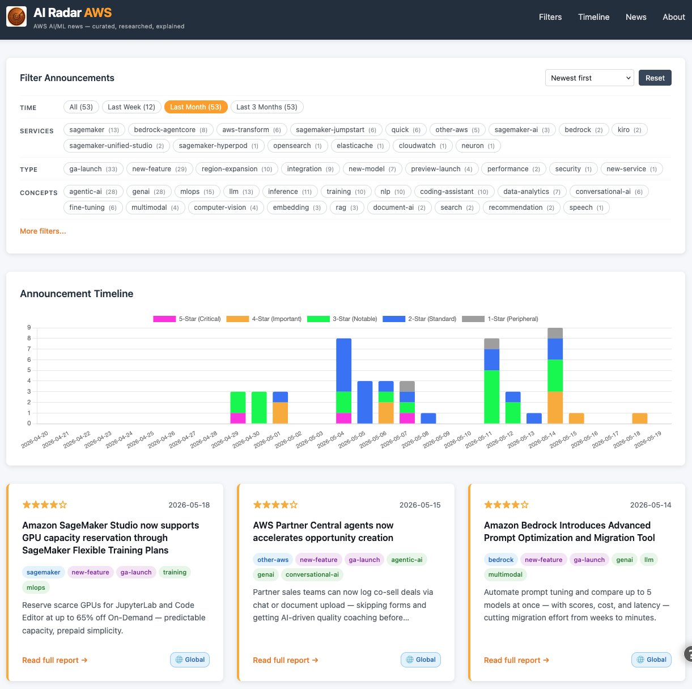
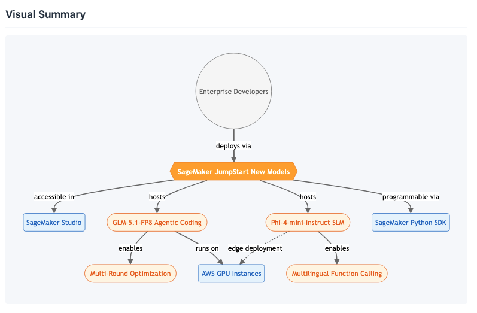

<p align="center">
  
</p>

<h1 align="center">AI Radar AWS</h1>

<p align="center">
  <em>AWS AI/ML news — curated, researched, explained</em>
</p>

<p align="center">
  
  
  
  
</p>

---

Automated AWS AI/ML/GenAI news curation platform. Fetches the [AWS "What's New" RSS feed](https://aws.amazon.com/new/) daily, filters for AI relevance, classifies importance, assigns taxonomy tags, generates LLM-powered reports with Mermaid diagrams via Amazon Bedrock, and publishes a static website via CloudFront.

<p align="center">
  
</p>

<p align="center">
  
</p>

## ✨ Key Highlights

- **Fully automated** — runs daily, no manual curation needed
- **LLM-powered analysis** — Claude Sonnet, Opus, and Haiku for reports, diagrams, and tagging
- **Research-backed** — follows blog post links and reads documentation for deeper context
- **5-star importance scoring** — point-based system with an optional geographic preference
- **Geographic relevance** — opt-in badges show whether announcements are available in your region
- **One-command deploy** — `./deploy.sh` sets up the entire stack from scratch

## 🏗️ Architecture

```
                                    ┌─────────────────────────────────────┐
                                    │         Amazon Bedrock              │
                                    │  Sonnet 4.6 │ Opus 4.6 │ Haiku 4.5  │
                                    └──────────────────┬──────────────────┘
                                                       │
┌──────────────┐     ┌─────────────────────────────────┼───────────────────┐
│  EventBridge │────▶│  Lambda 1: Report Pipeline      │                   │
│  (Daily)     │     │  RSS → Dedup → Filter → Tag ────┘                   │
└──────────────┘     │  → Classify → Research → Report → Graph → Store     │
                     └──────────────────────────┬──────────────────────────┘
                                                │ async invoke
                     ┌──────────────────────────▼────────────────────────────┐
                     │  Lambda 2: Website Builder                            │
                     │  Read CSV → Generate HTML/CSS/JS → Upload → Invalidate│
                     └───────┬──────────────────────────────────┬────────────┘
                             │                                  │
                     ┌───────▼───────┐                  ┌───────▼───────┐
                     │  S3 (Data)    │                  │  S3 (Website) │
                     │  CSV storage  │                  │  Static files │
                     └───────────────┘                  └───────┬───────┘
                                                                │
                                                        ┌───────▼───────┐
                                              ┌────────▶│  CloudFront   │◀──── Users
                                              │         │  + WAF        │
                                              │         └───────────────┘
                                              │
┌─────────────────────────────────────────────┼────────────────────────────┐
│  Analytics                                  │                            │
│  ┌────────────┐    ┌──────────┐    ┌────────▼───────┐                    │
│  │ Browser JS │───▶│ API GW   │───▶│ Lambda 3       │──▶ S3 (Logs)       │
│  │ (tracking) │    │ POST     │    │ Event Collector│   + CF Access Logs │
│  └────────────┘    └──────────┘    └────────────────┘                    │
└──────────────────────────────────────────────────────────────────────────┘
```

**Key services:** Python 3.11, Amazon Bedrock (Claude Sonnet 4.6 + Opus 4.6 + Haiku 4.5), CDK, S3, CloudFront, WAF, EventBridge, API Gateway

## Project Structure

```
├── src/
│   ├── config.py                    # Centralized configuration (models, prompts, thresholds)
│   ├── pipeline/                    # Lambda 1: Report Generation Pipeline
│   │   ├── handler.py              # Entry point
│   │   ├── orchestrator.py         # Pipeline coordination
│   │   ├── rss_fetcher.py          # RSS feed retrieval
│   │   ├── relevance_filter.py     # AI/ML keyword filtering
│   │   ├── importance_classifier.py # Point-based 1-5 star scoring
│   │   ├── tagger.py              # LLM-based taxonomy tagging (Haiku 4.5)
│   │   ├── research_agent.py      # Blogpost/doc link content extraction
│   │   ├── report_generator.py    # Structured report generation (Sonnet)
│   │   ├── graph_generator.py     # Mermaid diagram generation (Opus)
│   │   └── storage_manager.py     # S3 CSV persistence
│   ├── website_builder/            # Lambda 2: Static Site Generator
│   │   ├── handler.py             # Entry point
│   │   └── builder.py             # HTML/CSS/JS generation
│   ├── analytics/                  # Lambda 3: Event Collector
│   │   └── handler.py             # API Gateway → S3 JSONL
│   └── shared/                     # Shared modules
│       ├── logger.py              # Structured JSON logging
│       └── models.py              # Data models (dataclasses)
├── infrastructure/                  # CDK Infrastructure
│   ├── app.py                     # CDK app entry point
│   └── stack.py                   # Full stack definition
├── scripts/                         # Utility scripts
│   ├── _common.py                 # Shared helpers (region from Config, bucket lookup, context loading)
│   ├── analytics_report.py        # Generate analytics CSV report via Athena
│   ├── backup.py                  # Backup data (and optionally site) to a local zip
│   ├── pipeline_health.py         # Pipeline health report (daily run status)
│   ├── retag_announcements.py     # Retroactively tag existing announcements
│   ├── reclassify_announcements.py # Recompute importance scores
│   ├── compute_geo_relevance.py   # Backfill geographic relevance badges
│   ├── generate_card_summaries.py # Backfill card summaries for existing data
│   ├── generate_missing_graphs.py # Backfill visual summaries for 2+ star items
│   ├── regenerate_all_graphs.py   # Clear + regenerate all visual summaries
│   └── test_local.py             # Local pipeline testing with mocked AWS
├── tests/                           # Tests (pytest + hypothesis property-based)
│   └── fixtures/                  # Live-data snapshots for regression tests
├── docs/                            # Design documents and analysis
│   ├── taxonomy-analysis.md       # Multi-dimensional tagging taxonomy design
│   ├── mermaid-style-guide.md     # Visual summary standardization rules
│   └── audit-remediation-plan.md  # 2026-08 hardening audit: decisions + evidence
├── .github/workflows/ci.yml        # CI: tests + zero-config synth + secret hygiene
├── setup.sh                         # One-time environment setup
├── deploy.sh                        # One-command full deployment (and --destroy)
├── rebuild-site.sh                  # Quick redeploy + website rebuild
├── run-pipeline.sh                  # Trigger the pipeline with live progress
├── CHANGELOG.md                     # Issue tracking and feature log
├── cdk.json                         # CDK configuration (generic — no personal values)
├── cdk.context.json.example         # Template for your deployment's values (copy to gitignored cdk.context.json)
├── requirements.txt                 # Lambda runtime dependencies
└── requirements-dev.txt             # Development dependencies
```

## 🚀 Quick Start

### Prerequisites

- Python 3.11+
- Node.js 20+ (18 works with warnings)
- AWS CLI configured with credentials
- Bedrock model access enabled (Claude Sonnet 4.6, Opus 4.6, Haiku 4.5)

### Setup & Deploy

```bash
git clone https://github.com/bbonik/ai-radar-aws.git
cd ai-radar-aws
./setup.sh    # One-time: checks prerequisites, creates venv, installs everything

# Optional — personalize your deployment (domain, alert email, geography).
# Skipping this is fine: the stack deploys to a fully working default state.
cp cdk.context.json.example cdk.context.json && $EDITOR cdk.context.json

./deploy.sh   # Deploys the full stack to AWS
```

That's it. Two commands from zero to a running website (three if you personalize).

**After the first deploy:**
- If you set `alert_email`, check your inbox for an **"AWS Notification - Subscription Confirmation"** email and click the link — CloudWatch alarms notify nobody until you do. Without `alert_email`, the deploy prints a warning and you can subscribe to the `ai-radar-alerts` SNS topic manually later.
- Trigger the first pipeline run with `./run-pipeline.sh`, or wait for the daily schedule (22:00 UTC).

## 📋 Scripts Reference

| Script | Purpose | When to Use |
|--------|---------|-------------|
| `./setup.sh` | Check prerequisites, create venv, install deps | First time after cloning |
| `./deploy.sh` | Full deployment (tests + CDK + deploy) | First deploy or major infra changes |
| `./deploy.sh --destroy` | Tear down the stack — the **data bucket is retained** (it holds all generated reports); deleting it is a separate, explicit confirmation | Remove the deployment |
| `./rebuild-site.sh` | Deploy code + rebuild website | After code changes |
| `./rebuild-site.sh --skip-cdk` | Just rebuild website (no CDK) | After data-only changes |
| `./run-pipeline.sh` | Trigger pipeline with live progress | See real-time processing status |
| `./rebuild-site.sh --pipeline` | Run full pipeline + rebuild | Fetch new news manually |
| `python scripts/retag_announcements.py` | Tag existing announcements | After taxonomy changes |
| `python scripts/retag_announcements.py --force` | Re-tag ALL announcements | When taxonomy tags are updated |
| `python scripts/reclassify_announcements.py` | Recompute importance scores | After scoring changes |
| `python scripts/generate_card_summaries.py` | Generate card summaries | After adding summary feature |
| `python scripts/generate_missing_graphs.py` | Backfill visual summaries | After lowering graph threshold |
| `python scripts/regenerate_all_graphs.py` | Clear + regenerate ALL visual summaries | After changing graph style/prompt |
| `python scripts/compute_geo_relevance.py` | Compute geographic relevance badges | After changing preferred geography |
| `python scripts/pipeline_health.py` | Pipeline health report (daily run status) | Check if pipeline is running correctly |
| `python scripts/pipeline_health.py --days 30` | Extended health report | Investigate historical failures |
| `python scripts/backup.py` | Backup data CSV to local zip | Periodic disaster recovery backup |
| `python scripts/backup.py --full` | Backup data + website files | Full backup including generated HTML |
| `python scripts/analytics_report.py --days 30` | Generate analytics CSV | Check website usage metrics |

### Running the Pipeline Manually

The pipeline runs automatically daily at 22:00 UTC. To trigger it manually with progress reporting:

```bash
./run-pipeline.sh
```

This invokes the pipeline synchronously and shows:
- How many RSS items were fetched and deduplicated
- How many are relevant AI/ML announcements
- Per-announcement progress with title and star rating
- Errors (if any)
- Final summary with duration and success/failure counts

The website is automatically rebuilt when the pipeline finishes. Hard-refresh (Cmd+Shift+R) after ~1-2 minutes to see new announcements.

> **Note**: pipeline runs are serialised (concurrency capped at 1) because the pipeline does read-modify-write on the data store. If a manual run overlaps the scheduled one, the second invocation reports "a pipeline run is already in progress" — wait and retry.

## ⚙️ How It Works

1. **EventBridge** triggers Lambda 1 daily at 22:00 UTC
2. **RSS Fetcher** retrieves the AWS "What's New" feed (100 items)
3. **Deduplication** skips previously processed announcements (by link)
4. **Relevance Filter** applies regex patterns for AI/ML/GenAI keywords
5. **Taxonomy Tagger** (Haiku 4.5) assigns multi-dimensional tags across 6 dimensions (services from title only, types/concepts/use_cases/providers from full text, geo_availability via LLM)
6. **Importance Classifier** computes a point score → 1-5 stars (uses tags + geographic preference for scoring)
7. **Geographic Relevance** hybrid detection: preferred geography keyword match (authoritative) + LLM geo_availability + keyword fallback
8. **Research Agent** follows blogpost/doc links for additional context
9. **Report Generator** (Sonnet 4.6) produces structured 6-section reports + card summary
10. **Graph Generator** (Opus 4.6) creates Mermaid visual summaries (2-5 star only)
11. **Storage Manager** appends results to CSV in S3
12. **Lambda 2** rebuilds the static website from CSV data
13. **CloudFront** serves the site with WAF protection and access logging

## 🌐 Website Features

- **Faceted filtering** — clickable tag chips grouped by dimension (Services, Type, Concepts)
- **Time filtering** — All / Last Week / Last Month / Last 3 Months
- **Sort** — Newest first or Most important first
- **Taxonomy tags** — 5 dimensions: Services, Type, Concepts, Use Cases, Providers
- **Geographic relevance badges** — shows whether announcements are available in your preferred geography (configurable: APJ, EMEA, Americas, or Global)
- **Report pages** — 6 structured sections with bullet points + Mermaid visual summaries
- **PDF export** — browser-native print-to-PDF with a dedicated print stylesheet (no external library)
- **Timeline chart** — Stacked bar chart showing announcement volume over time (auto-aggregates to weekly when >90 days)
- **About modal** — Project methodology explanation
- **Analytics** — Client-side event tracking (pageviews, clicks, filter usage)

## 📊 Analytics

The site tracks usage via two mechanisms:
- **CloudFront access logs** → S3 (page views, unique IPs, geographic data)
- **Custom event tracking** → API Gateway → Lambda → S3 JSONL (clicks, filters, PDF exports)

Privacy and abuse controls on the custom-event path:
- Client IPs are **truncated at ingest** (IPv4 to /24, IPv6 to /48) — no per-device identifier is stored; "unique visitor" counts are distinct network prefixes, not distinct devices
- Raw logs and events expire after **90 days** via S3 lifecycle rules
- The endpoint is rate-limited (5 req/s, burst 20) and validates events against an allowlist with a 1 KB body cap

Generate a report:
```bash
python scripts/analytics_report.py --days 30 --output report.csv  # Save to file
python scripts/analytics_report.py --days 30                       # Print to stdout (no file created)
```

## 🔔 Monitoring & Alerts

The stack provisions six CloudWatch alarms (pipeline errors/timeout/duration, website-builder errors/timeout, CloudFront request spikes) plus a **$20/day cost budget**. All of them publish to the **`ai-radar-alerts`** SNS topic.

- Set `alert_email` in `cdk.context.json` before deploying and confirm the subscription email, and every alarm plus the budget alert reaches your inbox
- Check pipeline health from the CLI: `python scripts/pipeline_health.py`
- All logs are structured JSON with a per-run correlation ID (`run_id`) — filter CloudWatch Logs by `run_id` to trace one run end to end across both Lambdas

## 🛡️ Data Safety

The data bucket (announcement database + all generated reports — the only non-reproducible data in the system) is protected in depth:

- **S3 versioning** — every write creates a recovery point; a bad overwrite can be rolled back
- **Retention policy** — `cdk destroy` cannot delete the bucket; `./deploy.sh --destroy` retains it and offers deletion only behind a second, explicit confirmation
- **Write ordering** — the dedup index is written before the data row, so a mid-write crash can never duplicate an announcement on the site
- **Serialised runs** — pipeline concurrency is capped at 1, eliminating concurrent-write races
- **Local backups** — `python scripts/backup.py --output ~/backups` for an offline copy

The website and logs buckets are deliberately disposable — the site rebuilds from the data CSV at any time.

## 🔧 Configuration

All tunable parameters live in `src/config.py`:
- AWS region and schedule (daily at 22:00 UTC)
- LLM model IDs: Sonnet 4.6 (reports), Opus 4.6 (graphs), Haiku 4.5 (tagging)
- Importance scoring weights and thresholds
- Prompt templates (report, graph, tagger)
- Timeouts and retry settings

These are **generic project defaults**, identical for every deployment. Anything specific to *your* deployment (domain, alert email, geography preference) belongs in the gitignored `cdk.context.json` — see below. No secrets in the repository — all credentials come from IAM roles at runtime.

### Configuring Your Own Deployment

Deployment-specific values live in a gitignored `cdk.context.json` at the project root — never in committed files. Copy the example and edit:

```bash
cp cdk.context.json.example cdk.context.json
```

| Key | Purpose | If absent |
|-----|---------|-----------|
| `custom_domain` | Serve the site on your own domain | Default CloudFront URL is used |
| `certificate_arn` | ACM certificate for the custom domain | Required only with `custom_domain` |
| `hosted_zone_id` | Route 53 zone for the domain's alias record | No DNS record created |
| `alert_email` | Subscribes this address to the `ai-radar-alerts` SNS topic (CloudWatch alarms + the $20/day budget alert) | Alarms publish to the topic but nobody is subscribed; the deploy prints a warning |
| `preferred_geography` | Geographic scoring bias and badges: `apj`, `emea`, or `americas` | `global` — no bias, no badges |

Every key is optional: a fresh clone with no `cdk.context.json` deploys to a fully working default state.

**Precedence rule: values in `cdk.context.json` always override the defaults in `src/config.py`.** The two files are not competing settings — `config.py` holds the generic project defaults (identical for every deployment; don't put personal values there), and `cdk.context.json` holds *your* deployment's overrides. Deploy-time values (domain, certificate, email) are baked into the infrastructure by CDK; the runtime value (`preferred_geography`) reaches the Lambda in two hops:

```
cdk.context.json ──(cdk deploy: stack.py)──▶ Lambda env var PREFERRED_GEOGRAPHY
                                                       │
                                        (runtime: Config.__post_init__)
                                                       ▼
                                        Config().preferred_geography
```

The utility scripts read the same `cdk.context.json` (via `scripts/_common.py`), so laptop and Lambda always resolve identical configuration. To see which layer won, check the first log line of any pipeline run (or `./run-pipeline.sh` output) — it states the effective geography and its source.

Custom domain prerequisites:
- An ACM certificate for your domain, already validated (must be in **us-east-1** regardless of your stack's region — this is a CloudFront requirement)
- A Route 53 hosted zone for the parent domain

## 💰 Estimated Monthly Cost

Assumptions: ~16 new AI/ML announcements per week (~65/month), low website traffic (<10K page views/month).

| Service | Usage | Monthly Cost |
|---------|-------|-------------|
| **Bedrock — Sonnet 4.6** (reports) | 65 calls × ~2K input + 4K output tokens | ~$3.25 |
| **Bedrock — Opus 4.6** (diagrams) | 50 calls × ~2K input + 2K output tokens | ~$7.50 |
| **Bedrock — Haiku 4.5** (tagging) | 65 calls × ~1K input + 0.5K output tokens | ~$0.10 |
| **Lambda** (3 functions) | ~35 invocations/day, 1024MB, <5 min total | ~$0.02 |
| **S3** (3 buckets) | <50 MB storage, <1K requests/day | ~$0.01 |
| **CloudFront** | <10K requests, <1 GB transfer | ~$0.10 |
| **WAF** | 1 Web ACL + 2 rules | ~$6.00 |
| **API Gateway** (analytics) | <10K requests | ~$0.01 |
| **EventBridge** | 1 rule, 30 invocations | ~$0.00 |
| **CloudWatch** (logs + alarms) | 6 alarms, minimal logs | ~$0.50 |
| | | |
| **Total** | | **~$18/month** |

The dominant cost is **Bedrock Opus** (visual summaries) and **WAF** ($5/month for the Web ACL + $1/month per rule). Without WAF, the total drops to ~$12/month. Bedrock costs scale linearly with announcement volume.

> **Note**: Bedrock pricing varies by model and region. The estimates above use approximate on-demand pricing for the global inference profiles. Actual costs may differ based on token counts and regional pricing.

## 🔒 Security

- S3 buckets are fully private; the site is served only through CloudFront with Origin Access Control, WAF (rate limiting + AWS managed common rules), TLS 1.2+, and security headers
- The Content-Security-Policy pins `connect-src` to this deployment's own API endpoint; CDN scripts (Mermaid, Chart.js) are version-pinned with Subresource Integrity hashes
- All rendered content is HTML-escaped before templating; Mermaid runs with `securityLevel: 'strict'`
- Outbound research fetches are bounded: https-only, 2 MB per response, 8 URLs per announcement
- Client IPs are de-identified at ingest (see Analytics)

## 🛠️ Development

```bash
# Run all tests (pytest + hypothesis property-based tests)
pytest tests/ -q

# Run specific test
pytest tests/test_cdk_stack.py -v

# Format code
black src/ tests/
```

CI (GitHub Actions) runs on every push and pull request: the full test suite, a **zero-config synth check** (the stack must deploy for a fresh clone with no `cdk.context.json`), and a secret-hygiene scan. If your PR adds configuration, make sure absent values degrade to a working default — the synth check enforces this.

## 📄 License

MIT

---

<p align="center">
  Built with <a href="https://kiro.dev/">Kiro</a> — see <code>.kiro/specs/</code> for the full requirements → design → tasks spec that guided development.
</p>
