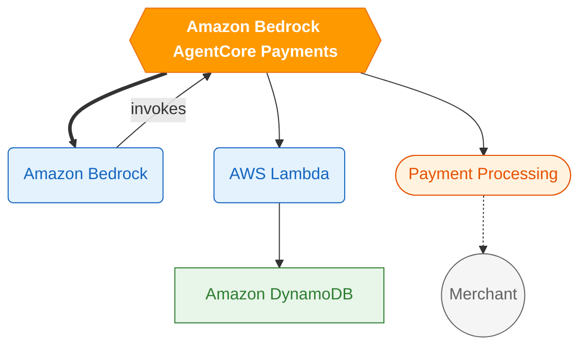

# AI Radar AWS — Mermaid Visual Summary Style Guide

## Problem

The current graph prompt produces inconsistent diagrams:
- Some are colorful, others monochrome
- Complexity varies wildly (3 nodes vs 15 nodes)
- No consistent meaning for colors, shapes, or line types
- The "announced feature" node isn't always visually distinct
- No legend or visual language that users can learn across diagrams

## Design Principles

1. **Consistency** — Every diagram follows the same visual language
2. **Scannability** — A user should understand the diagram in 5 seconds
3. **Semantic encoding** — Colors, shapes, and lines carry meaning
4. **Focus** — The announced feature is always the visual anchor

---

## Proposed Visual Language

### Node Shapes (what type of thing it is)

| Shape | Mermaid Syntax | Meaning |
|-------|---------------|---------|
| Rounded rectangle | `A(Label)` | AWS Service |
| Stadium/pill | `A([Label])` | Feature or capability |
| Hexagon | `A{{Label}}` | The announced feature (always exactly one) |
| Rectangle | `A[Label]` | Data store or resource |
| Circle | `A((Label))` | User/actor/external system |

### Colors (what category it belongs to)

| Color | Hex | Meaning |
|-------|-----|---------|
| **Orange** (fill) | `#ff9900` | The announced feature (always one node) |
| **Blue** (fill) | `#e3f2fd` | Compute/AI services (Bedrock, SageMaker, Lambda) |
| **Green** (fill) | `#e8f5e9` | Storage/data services (S3, DynamoDB, OpenSearch) |
| **Purple** (fill) | `#f3e5f5` | Developer tools (SDKs, APIs, IDEs) |
| **Gray** (fill) | `#f5f5f5` | External systems or users |

### Line Types (what kind of relationship)

| Line | Mermaid Syntax | Meaning |
|------|---------------|---------|
| Solid arrow | `A --> B` | Data flows to / invokes |
| Dashed arrow | `A -.-> B` | Optional or async relationship |
| Thick arrow | `A ==> B` | Primary/critical path |
| Dotted line (no arrow) | `A -.- B` | Logical grouping / association |

### Arrow Labels (what happens)

Short verb phrases on arrows to describe the interaction:
- `"invokes"`, `"reads from"`, `"writes to"`, `"triggers"`, `"returns"`
- Keep to 1-2 words maximum

### Layout

- Always use `graph TD` (top-down) for consistency
- The announced feature node is always at the top or center
- Related services fan out below
- 6-10 nodes is the sweet spot (never more than 12)

---

## Example: Standardized Diagram



---

## Implementation: Updated Prompt Template

The prompt should include:
1. The visual language rules (shapes, colors, lines)
2. The `classDef` declarations to include at the bottom
3. A concrete example showing the expected format
4. Explicit constraints (6-10 nodes, always TD, always one hexagon)

### Key additions to the prompt:

```
## Visual Language Rules (MUST follow exactly)

### Node shapes:
- The announced feature: hexagon syntax {{Label}} with class "announced"
- AWS services: rounded rectangle (Label) with class "compute" or "storage"
- Features/capabilities: stadium ([Label]) with class "feature"
- External systems/users: circle ((Label)) with class "external"

### Line types:
- Solid arrow (-->) for data flow / invocation
- Dashed arrow (-.->) for optional/async relationships
- Thick arrow (==>) for the primary integration path

### Required classDef block (include at the end of every diagram):
classDef announced fill:#ff9900,stroke:#ec7211,color:#fff,font-weight:bold
classDef compute fill:#e3f2fd,stroke:#1565c0,color:#1565c0
classDef storage fill:#e8f5e9,stroke:#2e7d32,color:#2e7d32
classDef feature fill:#fff3e0,stroke:#e65100,color:#e65100
classDef external fill:#f5f5f5,stroke:#616161,color:#616161

### Constraints:
- Always use graph TD (top-down layout)
- Exactly ONE node uses the hexagon shape (the announced feature)
- 6-10 nodes total (never more than 12)
- Every node must have a :::className applied
- Arrow labels are optional but encouraged (1-2 words max)
```

---

## Benefits

1. **Users learn the visual language** — after seeing 3-4 diagrams, they instantly know: orange hexagon = the new thing, blue = AI services, green = data, dashed = optional
2. **Consistent aesthetics** — all diagrams look like they belong to the same publication
3. **Predictable complexity** — always 6-10 nodes, never overwhelming
4. **Meaningful encoding** — shapes and colors carry information, not just decoration

---

## Migration

- New announcements will use the updated prompt automatically
- Existing diagrams can be regenerated with `scripts/generate_missing_graphs.py` (after clearing the `mermaid_graph` column)
- No website builder changes needed — Mermaid.js renders classDef styles natively

---

## Mermaid.js Compatibility Notes

- `classDef` is supported in Mermaid 9.0+
- `:::className` syntax for applying classes is supported in Mermaid 9.3+
- Our CDN loads Mermaid 10, so all features are available
- The `{{Label}}` hexagon syntax requires proper escaping in the LLM output
